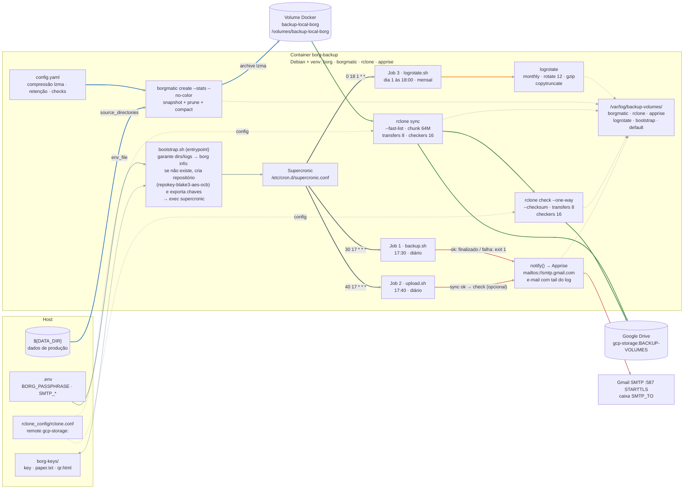
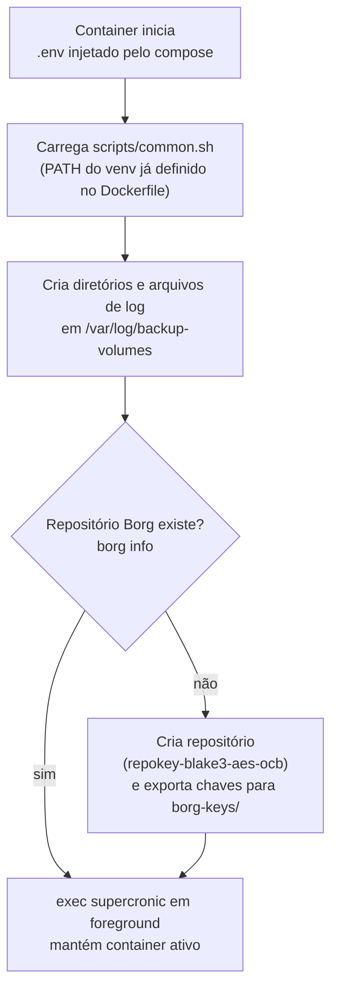

# Backup Solution

Serviço de backup automatizado do volume `vaultwarden-data`: snapshots deduplicados com [Borg](https://www.borgbackup.org/) orquestrados pelo [Borgmatic](https://torsion.org/borgmatic/), sincronizados ao Google Drive via [Rclone](https://rclone.org/) e agendados pelo [Supercronic](https://github.com/aptible/supercronic) em container [Docker](https://docs.docker.com).

## Sumário

- [Arquitetura](#arquitetura)
- [Quickstart](#quickstart)
- [Fluxo de inicialização](#fluxo-de-inicialização)
- [Configuração interna](#configuração-interna)
- [Referência de comandos](#referência-de-comandos)
- [Alterar a passphrase](#alterar-a-passphrase)
- [Restauração](#restauração)
- [Segurança](#segurança)

---

## Arquitetura



- **Retenção**: `keep_daily: 7`, `keep_weekly: 4`, `keep_monthly: 6`
- **Checks**: `repository`, `archives`, `extract` e `data` a cada 2 semanas
- **Upload**: espelho do repositório no Drive (`rclone sync` + `rclone check`) executado pelo job `upload.sh`; a verificação fica ativa por padrão e pode ser desativada via `UPLOAD_VERIFY=false` (`.env`) ou `--no-verify` na execução manual
- **Logs**: gravados em `/var/log/backup-volumes/*.log`; rotação mensal com retenção de 12 rotações (gzip)

---

## Quickstart

### 1. Configurar variáveis de ambiente

```bash
cp example.env .env
```

Edite `.env` com credenciais SMTP (Gmail) e senha forte para o repositório:

```env
SMTP_USER=<seu_usuario>
SMTP_PASS=<sua_senha>
SMTP_PORT=587
SMTP_TO=<destinatario>
DATA_DIR=<diretório_de_dados>
BORG_PASSPHRASE=<senha_forte>
UPLOAD_VERIFY=true # rclone check pós-upload; false para desativar
```

### 2. Configurar o rclone

O arquivo `rclone_config/rclone.conf` deve conter o remote `gcp-storage` apontando para o Google Drive.

> Recomendado: instale o rclone no host, autentique o remote e copie o `rclone.conf` para `rclone_config/`.

Teste o acesso:

```bash
docker compose run --rm debian_container rclone lsd gcp-storage: --config /root/.config/rclone/rclone.conf
```

Para reautorizar o remote (token expirado):

```powershell
# no host
rclone config reconnect gcp-storage: --config .\rclone_config\rclone.conf
```

### 3. Iniciar o serviço

```bash
docker compose up -d --build
```

No primeiro start, o `bootstrap.sh` cria o repositório Borg e exporta chaves para `borg-keys/`.

### 4. Executar um backup manual

```bash
docker compose exec borg-backup /bin/sh -c '/scripts/backup.sh'
```

### 5. Verificar logs

```bash
docker compose exec borg-backup ls -lh /var/log/backup-volumes/
docker compose exec borg-backup tail -f /var/log/backup-volumes/borgmatic.log
```

Logs antigos rotacionados ficam comprimidos em `/var/log/backup-volumes/` (`gunzip -c <arquivo>` para ler).

---

## Fluxo de inicialização

Resumo do `scripts/bootstrap.sh` (entrypoint do container):



---

## Configuração interna

| Arquivo | Função |
| --- | --- |
| `compose.yml` | Serviço `borg-backup`: monta `data`, volume Borg local, `borg-keys/`, configs e scripts; entrypoint é o `bootstrap.sh` |
| `Dockerfile` | `debian:bookworm-slim` + rclone + venv Python (`uv`) com BorgBackup, borgmatic e apprise |
| `config.yaml` | Fonte/repositório, compressão lzma, retenção e checks (as notificações ficam por conta dos scripts) |

| `.env` | Credenciais SMTP e `BORG_PASSPHRASE` |
| `config/supercronic.conf` | Agenda `backup.sh` (17:30 diário), `upload.sh` (17:40 diário) e `logrotate.sh` (dia 1 às 18:00) |
| `scripts/backup.sh` | Executa `borgmatic create`, grava log em `/var/log/backup-volumes/borgmatic.log` e notifica por e-mail |
| `scripts/upload.sh` | Espelha o repositório no Drive com `rclone sync` e valida com `rclone check` (padrão; controle via `UPLOAD_VERIFY` ou `--no-verify`) |
| `scripts/common.sh` | Variáveis compartilhadas (paths, `RCLONE_DEST`) e funções `log()` / `notify()` via Apprise |
| `config/logrotate.conf` | Rotação mensal dos logs em `/var/log/backup-volumes/`, 12 rotações gzip com `copytruncate` |

Observações:

- O repositório local é espelhado no Drive pelo job `upload.sh` após cada backup; para mudar destino/remoto, ajuste `RCLONE_DEST` em `scripts/common.sh`.
- Para incluir outras fontes, ajuste `source_directories` em `config.yaml`.

---

## Referência de comandos

No diretório do projeto use `docker compose exec borg-backup <comando>`; fora dele, `docker exec -it <nome_do_container> <comando>`.

| Ação | Comando |
| --- | --- |
| Listar archives | `docker compose exec borg-backup borg list -r /volumes/backup-local-borg` |
| Simular prune (retenção) | `docker compose exec borg-backup /bin/sh -c 'borgmatic prune --list --verbosity 2'` |
| Verificação de integridade | `docker compose exec borg-backup borg check --repo /volumes/backup-local-borg/ --verify-data -v` |
| Alterar passphrase do repositório | `docker compose exec borg-backup borg key change-passphrase -r /volumes/backup-local-borg` (ver [Alterar a passphrase](#alterar-a-passphrase)) |
| Comparar dois archives | `docker compose exec borg-backup borg diff -r /volumes/backup-local-borg <ARCHIVE1> <ARCHIVE2>` |
| Extrair arquivo p/ stdout | `docker compose exec borg-backup borg extract --stdout -r /volumes/backup-local-borg <ARCHIVE> volumes/vaultwarden-data/config.json > /tmp/v2.txt` |
| Listar pastas no Drive | `docker compose run --rm debian_container rclone lsd gcp-storage: --config /root/.config/rclone/rclone.conf` |
| Upload manual sem verificação | `docker compose exec borg-backup /bin/sh -c '/scripts/upload.sh --no-verify'` |
| Reautorizar rclone (host) | `rclone config reconnect gcp-storage: --config .\rclone_config\rclone.conf` |

---

## Alterar a passphrase

A passphrase protege a chave do repositório (criptografia `repokey-blake3-aes-ocb`) e chega ao Borg via `BORG_PASSPHRASE` (`.env` → `compose.yml`). A troca precisa alinhar **quatro pontas**: repositório, `.env`, chaves exportadas em `borg-keys/` e cópia no Drive. Siga esta ordem:

1. Trocar a senha no repositório — o container ainda tem o env antigo, então o Borg autentica com `BORG_PASSPHRASE` atual automaticamente e pede apenas a **nova** senha duas vezes:

```bash
docker compose exec borg-backup borg key change-passphrase -r /volumes/backup-local-borg
```

> Variante não-interativa (a nova senha fica visível no histórico do shell): `docker compose exec borg-backup sh -c 'BORG_NEW_PASSPHRASE="<nova_senha>" borg key change-passphrase -r /volumes/backup-local-borg'`.

2. Atualizar `BORG_PASSPHRASE` no `.env` do host.

3. Recriar o container para recarregar o env — `restart` **não** relê o `env_file`:

```bash
docker compose up -d --force-recreate borg-backup
```

4. Validar o acesso com a nova senha:

```bash
docker compose exec borg-backup borg info -r /volumes/backup-local-borg
```

5. Reexportar as chaves para `borg-keys/` — os arquivos antigos continuam criptografados com a senha anterior — e renovar as cópias offline:

```bash
docker compose exec borg-backup sh -c 'borg key export -r /volumes/backup-local-borg /volumes/borg-keys/repository.key && borg key export -r /volumes/backup-local-borg --paper /volumes/borg-keys/repository-paper.txt && borg key export -r /volumes/backup-local-borg --qr-html /volumes/borg-keys/repository-qr.html'
```

6. Rodar um backup manual para validar ponta a ponta e espelhar o repositório já com a nova chave no Drive:

```bash
docker compose exec borg-backup /bin/sh -c '/scripts/backup.sh'
```

Avisos:

- **Ordem importa**: se atualizar o `.env` antes de trocar a senha no repositório (ou esquecer de recriar o container), os backups falham até as duas pontas ficarem iguais.
- Até o próximo `rclone sync` concluído com sucesso (passo 6), a cópia do Drive ainda só abre com a senha **antiga**.
- Se existir mais de um repositório Borg, repetir todo o processo por repositório.

---

## Restauração

> **Observação:** o `borg extract` extrai para o diretório corrente do container, e cada `docker compose exec` abre um shell novo no `WORKDIR` da imagem (`/app`) — o `cd` não persiste entre execuções. Por isso o destino é definido no mesmo comando com `sh -c "mkdir -p <pasta> && cd <pasta> && borg extract ..."`. As extrações usam a pasta dedicada `/volumes/extracoes` (efêmera: perde ao recriar o container) e `--strip-components 2`, que remove o prefixo `volumes/data/` e deixa os arquivos direto na pasta.

1. Sincronizar o repositório do Drive para um diretório temporário:

```bash
docker compose exec borg-backup rclone sync gcp-storage:BACKUP-VOLUMES /tmp/backup-local-borg --config /root/.config/rclone/rclone.conf -v
```

2. Listar archives disponíveis:

```bash
docker compose exec borg-backup borg repo-list -r /tmp/backup-local-borg
```

3. Visualizar o conteúdo de um archive antes de extrair:

```bash
docker compose exec borg-backup borg list -r /tmp/backup-local-borg <NOME_DO_ARQUIVO>
```

> Use `| grep <padrão>` ou `| head -n 50` para filtrar a saída. Para simular a extração sem gravar nada: `borg extract --list --dry-run -r /tmp/backup-local-borg::<NOME_DO_ARQUIVO>`.

4. Extrair um snapshot completo para a pasta de extração dedicada:

```bash
docker compose exec borg-backup sh -c "mkdir -p /volumes/extracoes && cd /volumes/extracoes && borg extract --strip-components 2 -r /tmp/backup-local-borg <NOME_DO_ARQUIVO>"
```

O `--strip-components 2` remove o prefixo `volumes/data/` dos caminhos do archive, então os arquivos aparecem direto em `/volumes/extracoes`. Para disponibilizá-los no host, mova-os para `/volumes/data`.

5. Verificar o que foi extraído:

```bash
docker compose exec borg-backup ls -lhR /volumes/extracoes | head -n 30
```

6. Ou apenas arquivos/diretórios específicos (o caminho inclui o prefixo interno do archive):

```bash
docker compose exec borg-backup sh -c "mkdir -p /volumes/extracoes && cd /volumes/extracoes && borg extract --strip-components 2 -r /tmp/backup-local-borg <NOME_DO_ARQUIVO> volumes/data/path/do/arquivo"
```

7. Mova dados restaurados da snapshot para o diretório original com:

```bash
docker compose exec borg-backup bash -c "cd / && cp -r /volumes/extracoes/. /volumes/data/"
```

---

## Segurança

- Proteja `.env`, `borg-keys/` e `rclone_config/rclone.conf` — nunca os versionem.
- Guarde cópia offline das chaves (`repository.key`, `repository-paper.txt`, `repository-qr.html`); sem elas o repositório é irrecuperável.
- Nunca compartilhe `BORG_PASSPHRASE`.
- Ao rotacionar a passphrase ([Alterar a passphrase](#alterar-a-passphrase)), reexporte as chaves e garanta o sync com o Drive — senão as cópias offline/remota só abrem com a senha anterior.
- Valide o acesso SMTP antes de depender das notificações por e-mail.
- Faça restaurações de teste periódicas para garantir que chaves e backups funcionam.
